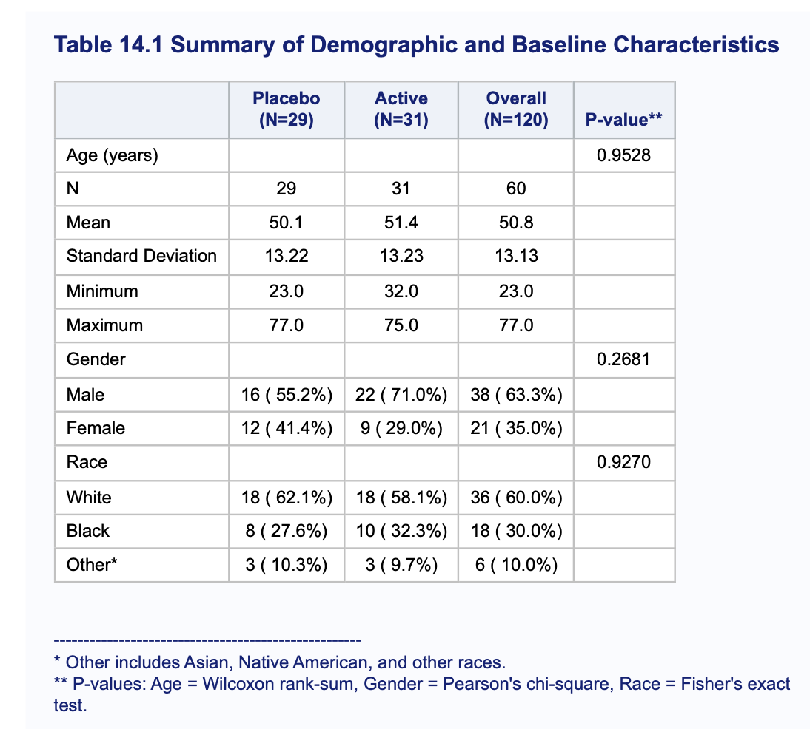

# Clinical-SAS-TLF-Development: Table 14.1

##  Overview
This project demonstrates the end-to-end development of a **Table 14.1: Summary of Demographic and Baseline Characteristics**. This is a primary deliverable in Clinical Trial reporting (CSR), used to verify that randomization was successful by comparing treatment arms (Active vs. Placebo).

The repository showcases three distinct SAS programming methodologies, ranging from quick data exploration to industry-standard production code for regulatory submissions.

---

## 📊 Final Clinical Output
Below is the final report generated by the industry-standard method (Program 04). It includes descriptive statistics for continuous variables and frequency distributions for categorical variables, along with comparative p-values.

---

---

##  Repository Structure

The project is organized into a logical execution sequence to ensure traceability and reproducibility:

| File | Name | Description |
| :--- | :--- | :--- |
| **01** | `01_data_init.sas` | **Foundation:** Defines global options, clinical formats, and creates the mock ADSL-style dataset with missing data handling. |
| **02** | `02_tabulate_method.sas` | **Rapid Review:** Uses `PROC TABULATE` for efficient, high-level data summaries. |
| **03** | `03_report_method.sas` | **Advanced Layout:** Demonstrates `PROC REPORT` with compute blocks for dynamic percentage calculations. |
| **04** | `04_clinical_standard.sas` | **Production Grade:** The final CSR output featuring $p$-values, multi-step data transposition, and professional formatting. |

---

##  Statistical Analysis Implementation
To evaluate baseline balance between treatment groups, the following statistical procedures are implemented in `04_clinical_standard_method.sas`:

* **Continuous Data (Age):** Analyzed using the **Wilcoxon Rank-Sum Test** (`PROC NPAR1WAY`) to account for potential non-normal distributions in small sample sizes.
* **Categorical Data (Gender/Race):** Analyzed using **Pearson’s Chi-Square** or **Fisher’s Exact Test** (`PROC FREQ`) to ensure representative distribution across arms.

---

##  Technical Competencies
* **CDISC Standards:** Logic designed to mimic ADaM (ADSL) data structures.
* **Data Reshaping:** Mastery of `PROC TRANSPOSE` for converting analysis results into report-ready formats.
* **Dynamic Reporting:** Use of Macro variables (`CALL SYMPUT`) to populate population counts ($N$) in headers.
* **Quality Control:** Handling of missing data (e.g., Subject 712) to ensure 100% accuracy in clinical reporting.

---

##  How to Run
1. Clone the repository to your local machine.
2. Run `01_data_init.sas` first to initialize the environment and create the `WORK.DEMOG` dataset.
3. Execute any of the analysis scripts (`02` through `04`) to generate the corresponding outputs.

